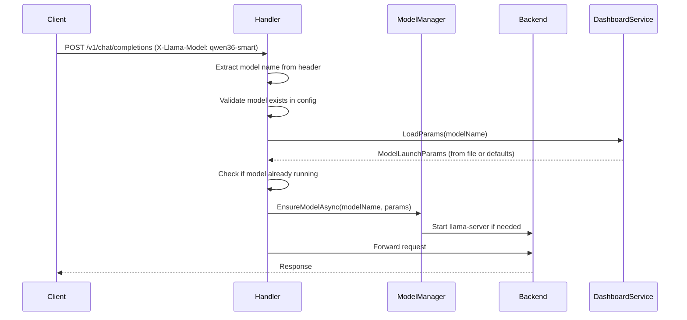

# ModelProxyHandler

## Responsibility

Routes incoming requests to appropriate llama-server backends based on `X-Llama-Model` header, manages model lifecycle (lazy start, hot switching), and handles parameter loading.

## Dependencies

| Dependency | Purpose |
|------------|----------|
| `IOptions<AppConfig>` | Application configuration (model configs) |
| `IMetaModelManager` | Model lifecycle operations (ensure, stop, get active) |
| `SystemIdleTracker` | Idle timeout monitoring |
| `IIdleTimeoutResetter` | Reset idle timer on requests |
| `DashboardService` | Load model parameters from `dashboard_params.json` |
| `IRequestForwarder` | Proxy requests to backend llama-server |
| `IHttpClientFactory` | HTTP client for health checks |
| `ILogger<ModelProxyHandler>` | Structured logging |

## Request Routing Flow



## Parameter Loading Strategy

### Source Priority

1. **`dashboard_params.json`** — Persisted parameters from admin API
2. **`ModelLaunchParams.Defaults`** — Fallback when file missing or model not found

### Implementation Pattern

```csharp
private ModelLaunchParams LoadParamsForModel(string modelName)
{
    try
    {
        return _dashboardService.LoadParams(modelName);
    }
    catch (Exception ex)
    {
        _logger.LogWarning(ex, "Failed to load params for model '{Model}', using defaults", modelName);
        return ModelLaunchParams.Defaults;
    }
}
```

### Parameter Type Precision

**Changed from `double?` to `decimal?`** for exact 2-decimal compatibility with llama-server.

Example:
- `double`: `0.6` → serialized as `0.6000000000000001` (floating point error)
- `decimal`: `0.6m` → serialized as `0.6` (exact precision)

## Model Lifecycle Management

### Lazy Start

Models only launch when first requested:
```csharp
await _modelManager.EnsureModelAsync(modelName, launchParams, context.RequestAborted);
```

### Hot Switching

Requesting a different model triggers:
1. Current model stops (via `EnsureModelAsync` internal logic)
2. New model starts with its parameters
3. Request forwarded to new backend

### Idle Shutdown

After `IdleTimeoutSeconds` of inactivity (default: 600s):
- `SystemIdleTracker` detects idle state
- `IdleTimeoutService` stops active model
- Next request triggers fresh start

## Error Handling

| Scenario | Response | Log Level |
|----------|----------|-----------|
| Missing `X-Llama-Model` header | 400 Bad Request | Warning |
| Unknown model name | 400 Bad Request | Warning |
| Model config missing backend URL | 503 Service Unavailable | Error |
| Parameter load failure | Use defaults, continue | Warning (logged) |
| Model start timeout | 503 Service Unavailable | Error |

## Health Check Integration

Before forwarding requests, `ModelManager` polls llama-server `/health`:
- Poll interval: 1 second (configurable)
- Timeout: 60 seconds (configurable)
- Success: Request forwarded to healthy backend
- Failure: 503 Service Unavailable response

## Warning: Model Already Running

When a model is already active and receives new parameters:
```csharp
_logger.LogWarning(
    "Model '{Model}' is already running — header launch params will be ignored (only the first start uses them)",
    modelName);
```

**Note**: Parameter updates via `PUT /admin/models/{name}/params` do NOT trigger restart. Model continues with old values until next start.

## Testing Patterns

- **Mock DashboardService**: Verify parameter loading behavior
- **Fake ModelManager**: Test routing logic without actual model starts
- **HttpContext mocks**: Validate header extraction and error responses

See `LlaModem.Tests/ModelProxyHandlerTests.cs` (create if not exists).

## Related Components

- [[Services/DashboardService]] — Parameter persistence and loading
- [[Services/ModelManager]] — Model lifecycle operations
- [[Config/architecture]] — AppConfig and model configuration structure
- [[powershell/README]] — Model launch scripts use loaded parameters

---

**Date**: 2026-05-19  
**Author**: Rigelion  
**Related Plan**: `.rpiv/artifacts/plans/2026-05-19_14-30-00_remove-header-body-injection.md`
